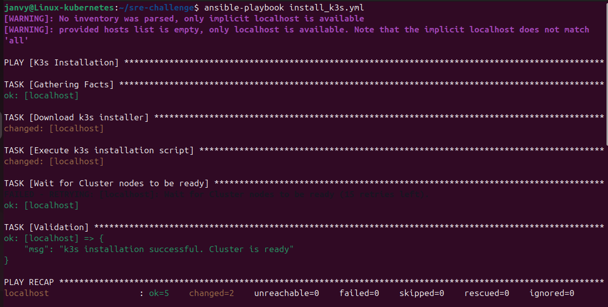
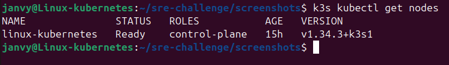
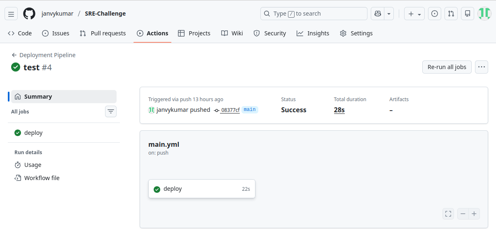
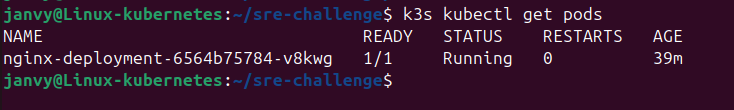

# K3s Automation & GitOps Deployment

## Overview
This repository contains the solution for the Site Reliability Engineering (SRE) challenge. The goal of this project is to automate the installation of a k3s Kubernetes cluster on Linux and establish a CI/CD pipeline for deploying a "Hello World" Nginx application.

## Project Structure
- **install_k3s.yml**: Automation script for k3s installation (Ansible).
- **nginx-app.yaml**: Kubernetes manifest for the Nginx application.
- **.github/workflows/main.yml**: GitHub Actions configuration for automatic deployment.

## Prerequisites
- A Linux machine (Ubuntu/Debian recommended).
- Ansible, Git, OpenSSH, vim editor installed on your linux machine.
  ```bash
  sudo apt update && sudo apt upgrade -y
  sudo apt install ansible git openssh-server -y
  sudo systemctl enable --now ssh
  sudo apt install vim

## Implementation Steps

### Part 1: Install k3s on a Linux Machine
The installation is automated using **Ansible**. It performs the following:
- Installs the latest stable version of k3s with a single node cluster.

***Create your project directory***
```bash
mkdir ~/sre-challenge && cd ~/sre-challenge
```
***Create the Playbook named install_k3s.yml***
```bash
vim install_k3s.yml
```
- [Ansible-script](install_k3s.yml)

***Run the script manually for verification***
```bash
ansible-playbook install_k3s.yml
```




### Part 2: Deploy "Hello World" Nginx Application
The kubernetes manifest file consists of:
- **Config Map** - It contains the "Hello World" HTML code.
- **Deployment** - It pulls the standard nginx:latest image. It mounts the HTML from the ConfigMap into the Nginx document root (/usr/share/nginx/html) using a volume and demonstrates secure secret handling.
- **Service** - It uses a NodePort (30080), which exposes the "Hello World" application on a specific port across the cluster node.

***Create a kubernetes Manifest file named nginx-app.yaml***
```bash
vim nginx-app.yaml
```
- [Kubernetes Manifest file](nginx-app.yaml)

### Part 3: Set Up Git Pipeline for Automatic Deployment
The pipeline is built using **GitHub Actions**. Upon every push to the `main` branch, the workflow:
- Validates the Kubernetes manifests.
- Connects to the k3s cluster using a secure Kubeconfig stored in GitHub Secrets.
- Deploys/Updates the application in the cluster.

***GitHub Self-Hosted Runner*** - I have used a Virtual box to demonstarte this project and since the VM is private, GitHub cannot reach into it. We install a runner on the VM that calls out to GitHub for instructions.

1. **On GitHub.com:** Go to your Repository → **Settings** → **Actions** → **Runners** → **New self-hosted runner**.
2. **Select "Linux":** GitHub will provide a list of commands.
3. **On your VM:** Create a separate folder for the runner and run the commands exactly as GitHub shows them:
```bash
mkdir ~/actions-runner && cd ~/actions-runner
(Paste and run the curl and config commands from GitHub here)
```
 4. **Start the runner:**
```bash
./run.sh
```
*Note: Keep this terminal window open. The runner must be "Listening" for the pipeline to work.*

 5. ***Configure GitHub Secrets***: 
To ensure the pipeline can securely handle sensitive data without hardcoding it, we add the API key to GitHub:

- In your GitHub repository, go to **Settings** > **Secrets and variables** > **Actions**.
- Click on **New repository secret**.
- **Name**: `API_KEY`
- **Value**: Enter your secret value (e.g., sre_challenge_2026).
- Click **Add secret**.

*Note: The pipeline uses the name `API_KEY` to create the Kubernetes secret dynamically during deployment.*


***Set up the GitHub pipeline Code***
This code tells GitHub what steps to take when a code is pushed.
```bash
cd ~/sre-challenge
mkdir -p .github/workflows
```
Create the workflow file
```bash
vim .github/workflows/main.yml
```
- [github-workflow-file](.github/workflows/main.yml)

### Part 4: Push to GitHub
***Initialize Git and push***
```bash
cd ~/sre-challenge
git init
git remote add origin https://github.com/YOUR_USERNAME/YOUR_REPO_NAME.git
git add .
git commit -m "Initial SRE project commit"
git branch -M main
git push -u origin main
```




### Part 5: Validation

Go to the **Actions** tab on GitHub Repository. You will see the pipeline running.
Once it turns green, check the app in the VM browser: 
http://localhost:30080


You can verify the secret injection by running this command on your cluster.
```bash
k3s kubectl exec -it <pod-name> -- printenv | grep APP_SECRET_KEY
```
